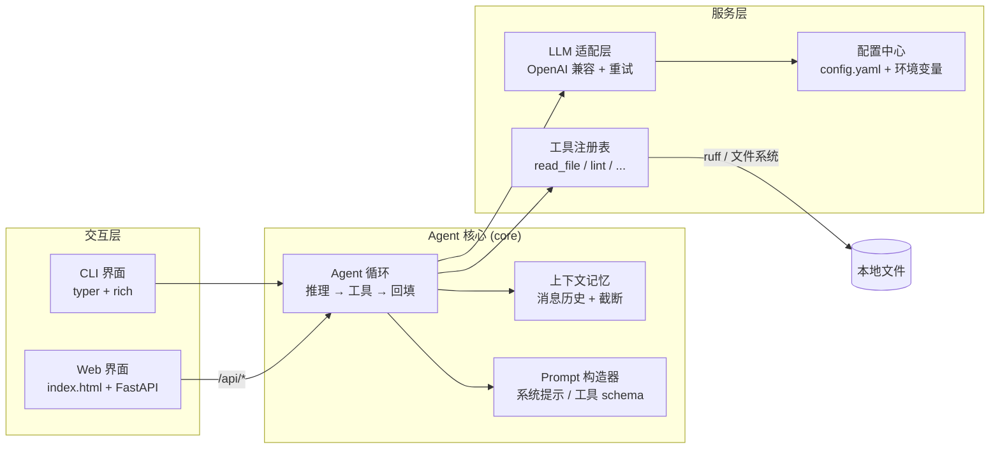

# Code Review Agent —— 设计文档（Design.md）

> 项目：Code Review Agent
> 文档版本：v1.1（正式）
> 最后更新：2026-09-28

---

## 1. 项目概述

### 1.1 项目目标

实现一个**代码审查 Agent**：用户给出一个文件或目录，Agent 自主完成「读取代码 → 分析问题 → 调用工具验证 → 生成审查报告 →（可选）应用修复」的完整闭环，并通过 **CLI** 与 **Web** 两种界面交互。

通过本项目实践 Agent 开发的核心能力：LLM 调用、Prompt 设计、工具集成、上下文记忆、错误处理，以及工程化的文档与版本管理。

### 1.2 交付物清单

| 交付物 | 说明 |
|--------|------|
| 源代码仓库 | Git 管理，含全部源码与测试 |
| `README.md` | 项目简介、安装、使用方法、演示 |
| `Design.md` | 本文档：架构与设计决策 |
| `docs/开发文档.md` | 开发进度、模块状态、变更记录 |
| `docs/测试文档.md` | 测试用例、执行结果、问题记录 |
| Web 界面 | `index.html` + CSS/JS，简约美观 |
| CLI 界面 | 命令行交互，支持交互式会话 |

### 1.3 核心设计原则（为什么这样做）

1. **手写 Agent 循环，不引入重型框架**：架构清晰、可解释是本项目的第一优先级。自己实现循环使数据流完全透明，Design.md 与代码一一对应；LangChain/AutoGen 的抽象反而会掩盖设计思路。框架对本项目规模属于过度工程。
2. **一层适配兼容所有 OpenAI 格式服务商**：DeepSeek 与小米 MiMo 均提供 OpenAI 兼容接口，只需可配置的 `base_url / api_key / model` 三个字段即可切换，未来接入任何兼容服务商零改码。
3. **CLI 与 Web 共享同一 Agent 内核**：界面只是壳，核心逻辑只有一份，保证行为一致、测试只需覆盖一处。
4. **安全默认**：涉及文件写入的「自动修复」必须经过用户确认；API Key 只存本地配置文件且被 gitignore。

---

## 2. 技术选型

| 层面 | 选型 | 理由 |
|------|------|------|
| 语言 | Python ≥ 3.10 | 类型标注与现代语法支持完善；生态最全 |
| LLM SDK | `openai`（兼容模式） | DeepSeek / MiMo / OpenAI 通用，一个 SDK 打通三家 |
| Agent 框架 | **不用**，手写循环 | 见 1.3-① |
| CLI 框架 | `typer` + `rich` | 子命令清晰；rich 提供彩色表格/代码高亮，UI 简约好看 |
| Web 框架 | `FastAPI` + `uvicorn` | 轻量；托管静态 `index.html` 与 JSON API |
| 前端 | 原生 HTML + CSS + JS | 无构建步骤，`index.html` 可直接浏览器预览 |
| 静态检查工具 | `ruff` | 作为 Agent 的工具之一执行真实 lint |
| 配置 | `config.yaml` + `.env` 覆盖 | 人可读，便于部署前替换 Key |
| 测试 | `pytest` + mock LLM | 单测不依赖真实 API，CI 友好 |
| 版本管理 | Git | 功能分支开发，main 只读 |

依赖预算：全部为轻量库，`requirements.txt` 控制在 10 个以内。

---

## 3. 总体架构

### 3.1 架构图



### 3.2 分层职责

| 层 | 模块 | 职责 | 不做什么 |
|----|------|------|----------|
| 交互层 | `cli/`、`web/` | 收集输入、渲染结果、配置管理 UI | 不含任何审查逻辑 |
| 核心层 | `core/agent.py` | Agent 循环、终止判断、工具调度 | 不关心界面与网络细节 |
| 核心层 | `core/memory.py` | 会话消息历史、截断与摘要 | 不持久化到数据库 |
| 核心层 | `core/prompt.py` | 系统提示词、工具 schema 组装 | — |
| 服务层 | `llm/client.py` | 统一 LLM 调用、重试、超时、流式 | 不理解业务 |
| 服务层 | `tools/` | 各工具的实现与校验 | 不直接调用 LLM |
| 基础设施 | `config.py` | 配置加载、合并、校验、脱敏展示 | — |

依赖方向自上而下单向，`core` 不 import `cli/web`，保证内核可独立测试。

---

## 4. Agent 循环设计（核心）

### 4.1 循环流程

采用 **ReAct（Reason + Act）模式**：

```
用户输入（审查目标 + 可选补充要求）
   │
   ▼
┌─────────────────────────────────────────────┐
│ 1. 组装消息：系统提示 + 历史 + 用户输入      │
│ 2. 调用 LLM（携带工具 schema）              │
│ 3. 判断返回：                               │
│    ├─ tool_calls → 逐个执行工具              │
│    │     ├─ 成功：结果作为 tool 消息回填      │
│    │     └─ 失败：错误信息回填（模型自行纠正）│
│    │     └→ 回到第 2 步                      │
│    └─ 纯文本 → 最终审查报告，结束            │
│ 4. 终止条件（任一满足）：                    │
│    · 返回纯文本 / 无工具调用                 │
│    · 达到 max_iterations（默认 8）           │
│    · 连续致命错误（配置缺失、认证失败）       │
└─────────────────────────────────────────────┘
   │
   ▼
结构化审查报告（问题列表 + 严重级别 + 修复建议）
```

### 4.2 关键设计点

- **结构化输出**：系统提示词要求最终报告为约定 JSON Schema（问题数组：`severity / file / line / message / suggestion`），CLI 与 Web 各自渲染，模型偶尔输出不合规时做容错解析（提取 JSON 代码块），解析失败则降级展示原始文本。
- **防失控**：`max_iterations` 硬上限；单次工具执行超时（默认 30s）；超限时用已有信息强制生成「部分报告」并标注未完成项，而不是直接失败。
- **工具结果回填**：工具报错不抛给用户，而是转成 `Error: ...` 文本回填给模型，让模型有机会换路径（例如文件太大 → 改用分段读取）。
- **每轮留痕**：循环内每一步（LLM 调用、工具名、参数、耗时）记入日志与 Web 时间线，既便于调试，也让「Agent 在想什么」可视化——这是架构展示的一部分。

---

## 5. 工具集设计

工具以注册表形式实现，每个工具声明 JSON Schema（名称、参数、描述），由统一入口分发。首期实现 5 个：

| 工具 | 参数 | 说明 | 失败处理 |
|------|------|------|----------|
| `list_dir` | `path`, `recursive?` | 列出目标目录结构（默认深度 3，忽略 `.git/node_modules`） | 路径不存在 → 返回错误文本 |
| `read_file` | `path`, `start?`, `end?` | 读取文件内容；**超过 400 行强制分段**，防超上下文 | 编码错误 → 回退 `utf-8` 再试，仍失败报错 |
| `search_code` | `pattern`, `path?` | 正则搜索代码，返回命中行（复用 `ripgrep` 逻辑，纯 Python 实现） | 无效正则 → 错误回填 |
| `run_lint` | `path` | 以子进程执行 `ruff check --output-format json`，返回真实 lint 结果 | 超时/未安装 → 明确报错（降级提示） |
| `apply_fix` | `path`, `old_code`, `new_code` | **写文件工具**：定位并替换代码实现自动修复 | ① `old_code` 必须唯一匹配，否则拒绝；② **CLI/Web 均需用户二次确认**才执行；③ 执行前自动备份为 `.bak` |

安全边界：所有工具的 `path` 做规范化并限制在用户指定的审查根目录内（防路径穿越）；`apply_fix` 默认在配置中开启但逐次确认，可配置整体禁用。

---

## 6. LLM 适配层设计

### 6.1 统一接口

```python
# 伪代码：服务层唯一入口
class LLMClient:
    def __init__(self, cfg: LLMConfig): ...      # 由配置中心注入
    def chat(self, messages, tools) -> Response   # 非流式（CLI 循环用）
    def chat_stream(self, messages, tools) -> Iterator  # 流式（Web 用）
```

底层使用 `openai` SDK 的 `base_url` 机制——**一个客户端覆盖所有兼容服务商**。

### 6.2 服务商预设（可视化配置的核心）

配置中心内置预设，用户在 Web 设置页 / CLI `config` 命令里**只选服务商 + 填 Key**，`base_url`/`model` 自动带出、仍可手工覆盖：

| provider 预设 | base_url 默认值 | model 默认值 |
|---------------|-----------------|--------------|
| `deepseek` | `https://api.deepseek.com/v1` | `deepseek-chat` |
| `mimo` | `https://api.xiaomimimo.com/v1` | `mimo-v2.6-pro` |
| `openai-compatible` | 手填 | 手填 |

\* MiMo 预设已于 2026-09-28 按官方文档与 `/v1/models` 实测校准；预设只是省事的默认值，任何字段都可手工覆盖（如改用 `mimo-v2.6-flash` 降低额度消耗）。

### 6.3 配置优先级与数据流

```
CLI 参数（--provider/--model/--base-url）
   ＞ 环境变量（CRA_API_KEY 等）
   ＞ config.yaml
   ＞ 内置预设
```

`config.yaml` 结构：

```yaml
provider: deepseek            # deepseek | mimo | openai-compatible
base_url: ""                  # 留空则用预设
api_key: ""                   # 或改用环境变量 CRA_API_KEY
model: ""                     # 留空则用预设
temperature: 0.2              # 审查任务偏低，保证稳定
max_iterations: 8             # Agent 循环上限
tool_timeout: 30              # 单工具超时（秒）
auto_fix_enabled: true        # 是否允许 apply_fix（仍需逐次确认）
```

- `config.yaml`、`.env` 进 `.gitignore`；仓库只提交 `config.example.yaml`。
- Web 设置页与 CLI `config` 命令**读写同一份配置**，互相可见。
- API Key 展示时脱敏（`sk-***abc`），不回传明文。
- **连通性自检**：提供「测试连接」按钮/命令，发一次最小请求验证 Key 有效，这是用户切换服务商后的第一反馈。

### 6.4 错误处理与重试

| 错误类别 | 策略 |
|----------|------|
| 超时 / 429 / 5xx | 指数退避重试，默认 3 次（1s → 2s → 4s） |
| 401 认证失败 | **不重试**，立即提示检查 Key/服务商 |
| 内容过滤 / 参数错误 | 不重试，原样透出错误信息 |
| JSON 输出解析失败 | 一次「修复性重问」（要求重新输出合法 JSON），再失败降级展示原文 |
| 工具执行异常 | 错误回填模型（见 4.2），不中断循环 |

所有重试与降级均写入日志，`docs/开发文档.md` 记录设计依据。

---

## 7. 上下文记忆设计

- **会话内记忆**：保存完整消息历史（system / user / assistant / tool），支持多轮追问（如「第 3 个问题怎么修？」）。
- **截断策略**：历史超过阈值（默认保留最近 20 条消息，且估算 token < 60k）时，从最旧的普通对话开始丢弃，**工具结果优先丢、系统提示永不丢**；丢弃时在 prompt 中注明「（更早的对话已省略）」。
- **会话持久化**：每个会话存为 `sessions/<session_id>.json`，CLI 与 Web 可恢复历史会话；提供 `--no-memory` 单次模式。
- **跨会话不记忆**：不做向量库/RAG——超出项目需要，且会模糊架构重点。

---

## 8. CLI 界面设计

入口统一：`python main.py <命令>`（`main.py` 位于项目根目录）。

| 命令 | 功能 |
|------|------|
| `review <path>` | 核心命令：审查文件/目录，支持相对路径、绝对路径与任意磁盘目录 |
| `chat [-r 目录]` | 交互式 REPL：多轮对话 + 实时时间线；`--root` 指定任意审查根，会话内可用 `/cd <目录>` 切换 |
| `config show / set / test` | 查看（Key 脱敏）、修改配置、测试 LLM 连接 |
| `web` | 启动 Web 服务（默认 `127.0.0.1:8000`） |
| `--help` | 全局帮助（含外部目录用法示例） |

UI 风格（rich）：进入 `review` / `chat` / `web` 时先打印 figlet 大字艺术字横幅（含版本与审查边界）；审查结果按严重级别着色（🔴 Error / 🟡 Warning / 🔵 Suggestion），文件行号用等宽高亮；工具调用以 `⚙ 调用 read_file(path=...) → 123ms` 的时间线形式滚动展示；非结构化的模型输出按 Markdown 渲染，让用户看到 Agent 的思考过程。

示例效果：

```
━━ Code Review Agent ━━━━━━━━━━━━━━━━━━━━━
 ⚙ read_file(app.py)              ✓ 45ms
 ⚙ run_lint(app.py)               ✓ 310ms
 🔴 app.py:42  可能的 SQL 注入 — 建议使用参数化查询
 🟡 app.py:17  函数过长（68 行）— 建议拆分
 ── 共 2 个问题：1 严重 / 1 一般 ──────────
```

---

## 9. Web 界面设计

### 9.1 形态与技术

- **单页应用**：`index.html` + `css/style.css` + `js/app.js`，位于项目根目录，由 FastAPI 托管，**无构建步骤**，浏览器直接打开 `index.html` 即可预览静态骨架。
- **API（FastAPI）**：

| 方法 | 路径 | 用途 |
|------|------|------|
| GET | `/api/config` | 读配置（Key 脱敏） |
| PUT | `/api/config` | 保存配置（可留空 Key 表示不修改） |
| POST | `/api/config/test` | 测试 LLM 连通性 |
| GET | `/api/fs/list?path=` | 目录浏览：path 为空返回盘符，否则返回子目录（选择目录弹窗用） |
| POST | `/api/review` | 发起审查 `{path, root?, code?, ask?}`；`root` 可为任意本地目录 |
| GET | `/api/review/{id}/timeline` | 轮询获取工具时间线与结果 |
| POST | `/api/fix` | 应用报告中的修复 `{path, old_code, new_code, task_id}`；`task_id` 用于定位项目外的审查根 |

长任务用「轮询时间线」而非 WebSocket——实现简单可靠，且时间线本身就是产品展示点；审查根（`root`）由目录选择器显式指定，服务端校验目标始终位于所选根之内。服务仅监听 `127.0.0.1`（本地单用户工具）。

### 9.2 页面布局与视觉风格

**风格定位：简约工具风**——中性浅灰背景 + 白色卡片 + 单一强调色，系统字体栈，克制的圆角与阴影，无多余动效。

```
┌──────────────────────────────────────────────────────┐
│ 顶栏：◆ Code Review Agent        [deepseek ●已连接] ⚙ │
├───────────────┬──────────────────────────────────────┤
│ 侧栏          │  审查目标                             │
│  · 新建审查   │  ┌──────────────────────────────────┐ │
│  · 历史会话   │  │ [📁 选择目录]（任意本地目录）      │ │
│  ·──────────  │  │ [子路径]         [开始审查 ▶]     │ │
│  · 会话1 ✓    │  └──────────────────────────────────┘ │
│  · 会话2 ⏳    │  执行时间线（Agent 实时动作）         │
│               │   ⚙ run_lint  → ✓ 310ms              │
│               │  审查报告                             │
│               │   🔴 app.py:42  SQL 注入风险          │
│               │     详情 ▾  [应用修复（需确认）]       │
│               │   🟡 app.py:17  函数过长              │
└───────────────┴──────────────────────────────────────┘
```

- **目录选择器**：点「📁 选择目录」弹出导航窗（盘符 → 逐级下钻 →「选择此目录」），审查根可以是**任意本地目录**——代码不必位于本项目之下；服务端再次校验目标路径始终在所选根内。
- **设置面板**（点顶栏状态或 ⚙ 打开）：服务商下拉（deepseek / mimo / 自定义）→ 自动填充 base_url/model → 填 Key →「测试连接」→ 保存，即可视化的服务商/API 配置接口。
- **报告卡片**：按严重级别分组，可折叠详情；「应用修复」按钮触发确认弹窗 → 调 `apply_fix` → 卡片变绿勾。
- **响应式**：≥960px 双栏，以下侧栏折叠为顶栏下拉，保证笔记本演示不出滚动条。
- 配色规范：背景 `#F6F7F9`、卡片 `#FFFFFF`、正文墨色 `#1F2329`、强调 `#2F6BFF`；严重级别 🔴 `#E5484D`、🟡 `#F5A623`、🔵 `#2F6BFF`。深色模式列为可选项（非必须）。

---

## 10. 目录结构

```
code-review-agent/                 # Git 仓库根目录
├── main.py                        # 统一入口（CLI 路由）
├── config.example.yaml            # 配置模板（入库）
├── config.yaml                    # 实际配置（gitignore）
├── requirements.txt
├── README.md                      # 使用文档
├── Design.md                      # 本设计文档
├── docs/
│   ├── 开发文档.md                # 进度 / 模块状态 / 变更记录
│   └── 测试文档.md                # 用例 / 结果 / 问题记录
├── app/                           # Python 包
│   ├── config.py                  # 配置中心
│   ├── llm/
│   │   └── client.py              # LLM 适配层（含重试）
│   ├── core/
│   │   ├── agent.py               # Agent 循环
│   │   ├── memory.py              # 上下文记忆
│   │   └── prompt.py              # Prompt 与工具 schema
│   ├── tools/
│   │   ├── registry.py            # 工具注册与分发
│   │   └── builtin.py             # 5 个内置工具实现
│   ├── cli/
│   │   └── app.py                 # typer 命令与 rich 渲染
│   └── web/
│       ├── server.py              # FastAPI 路由
│       └── api_models.py          # 请求/响应模型
├── index.html                     # Web 入口（根目录，可直接预览）
├── css/style.css
├── js/app.js
├── tests/                         # pytest
│   ├── test_config.py
│   ├── test_tools.py
│   ├── test_agent.py              # mock LLM 驱动循环
│   └── test_llm_retry.py
├── sessions/                      # 会话持久化（gitignore）
└── .gitignore
```

---

## 11. Git 版本管理方案

分支策略：**main 只读、功能分支开发、自测通过后合并、文档实时同步**。

### 11.1 分支规划

| 分支 | 内容 | 合并时机 |
|------|------|----------|
| `main` | 稳定版，仅通过合并进入 | — |
| `feat/skeleton` | 仓库骨架、配置中心、依赖 | 配置层自测通过 |
| `feat/llm` | LLM 适配层 + 重试 | mock 单测通过 |
| `feat/tools` | 工具注册表 + 5 个工具 | 工具单测通过 |
| `feat/agent` | Agent 循环 + 记忆 + Prompt | 循环集成测试通过 |
| `feat/cli` | CLI 命令与渲染 | 手工冒烟通过 |
| `feat/web` | FastAPI + index.html | 端到端自测通过 |
| `docs/*` | 文档完善、提交材料打包 | 终审前 |

### 11.2 提交规范

- Commit message：`feat/tools: 新增 run_lint 工具`、`fix/agent: 修复循环超限未降级`、`docs: 更新测试文档第 3 节`（类型/范围: 中文描述）。
- 每个功能点一个小提交，禁止一次巨型提交。
- **文档与代码同提交**：涉及行为变化的 commit 必须同步更新 `开发文档.md`（变更记录表），设计层面的变化同步 `Design.md`。
- 合并前跑 `pytest` + 冒烟命令；合并用 `--no-ff` 保留分支轨迹。

---

## 12. 文档体系

| 文档 | 内容大纲 | 更新时机 |
|------|----------|----------|
| `README.md` | 项目简介 / 效果截图 / 快速开始 / CLI 用法 / Web 用法 / 配置说明 / 目录结构 | 每次功能合并 |
| `Design.md` | 本文档 | 设计变更即改 |
| `docs/开发文档.md` | 项目进度总览（模块状态表）/ 各模块设计补充 / **变更记录表**（日期·分支·内容）/ 待办事项 | 每次提交 |
| `docs/测试文档.md` | 测试环境 / 单测用例表 / 手工测试用例表（含边界）/ 执行结果 / 缺陷与修复记录 | 每轮测试 |

四份文档互相引用不重复：README 管「怎么用」，Design 管「为什么」，开发文档管「做到哪」，测试文档管「验证过什么」。

---

## 13. 测试方案（详见 docs/测试文档.md，此处为设计）

### 13.1 单元测试（pytest，不依赖真实 API）

| 模块 | 关键用例 |
|------|----------|
| `config` | 预设填充、优先级（CLI＞env＞yaml）、Key 脱敏、非法 provider 报错 |
| `tools` | 正常读写 / 路径穿越拒绝 / 超长文件分段 / 无效正则 / `apply_fix` 非唯一匹配拒绝 |
| `llm` | 用 mock transport 验证：5xx 重试 3 次退避、401 不重试、超时不重试 |
| `agent` | mock LLM 序列驱动：纯文本直接结束、多轮工具调用收敛、超 `max_iterations` 降级、工具报错回填后能改道 |

### 13.2 集成与手工测试

- **离线链路**：`review` 命令打桩 LLM，验证 CLI 报告渲染与 JSON 容错。
- **在线链路**（需真实 Key，发布前执行）：用配置的服务商各跑一次真实审查，记录于测试文档。
- **边界用例**：空文件 / 单行文件 / 5000 行大文件 / 二进制文件 / 中文路径 / 不存在的路径 / 无 api_key 启动 / 断网。
- **UI 验收**：Web 各断点宽度、设置连通性、修复确认弹窗、时间线滚动。

### 13.3 验收标准

- 功能完整性：样例代码能被正确审查（预埋缺陷全部可检出），边界用例不崩溃，修复流程闭环。
- 架构：循环、工具、记忆、适配层模块边界清晰，时间线可见工具调用链。
- 代码质量：pytest 全绿、无裸 `except`、类型注解、关键逻辑中文注释。
- 文档：四份文档齐全且与代码一致。

---

## 14. 开发里程碑

| 阶段 | 内容 | 产出 | 预估 |
|------|------|------|------|
| M1 | 仓库初始化、目录骨架、配置中心、git 流程建立 | `feat/skeleton` 合并 | 0.5 天 |
| M2 | LLM 适配层 + 重试 + 连通性自检 | `feat/llm` 合并 | 0.5 天 |
| M3 | 工具注册表 + 5 工具 | `feat/tools` 合并 | 1 天 |
| M4 | Agent 循环 + 记忆 + Prompt | `feat/agent` 合并 | 1 天 |
| M5 | CLI（review / chat / config） | `feat/cli` 合并 | 0.5 天 |
| M6 | Web（API + index.html UI） | `feat/web` 合并 | 1 天 |
| M7 | 全量测试、在线链路验证、文档定稿 | `docs/*` 合并 | 1 天 |
| M8 | 发布准备（README/示例定稿、上线检查） | 可发布仓库 | 0.5 天 |

依赖关系：M2、M3 可并行；M4 依赖 M2+M3；M5/M6 依赖 M4。

---

## 15. 风险与取舍

| 风险 | 影响 | 应对 |
|------|------|------|
| MiMo API 端点/模型名与预设不符 | 切换服务商失败 | 预设可覆盖；实现期查官方文档校准；连通性自检先行 |
| 模型 JSON 输出不稳定 | 报告无法结构化渲染 | 容错解析 + 一次修复性重问 + 降级原文展示 |
| 大文件撑爆上下文 | 成本高/报错 | `read_file` 强制分段 + 历史截断 + `max_iterations` |
| Web 长任务超时 | 审查中断 | 时间线轮询 + 服务端任务状态机（pending/running/done/error） |
| 自动修复改坏代码 | 用户信任受损 | 确认弹窗 + `.bak` 备份 + `old_code` 唯一匹配校验 |
| 排期紧张 | 功能砍半 | 优先级：CLI 审查闭环 > Web 展示 > 修复工具 > 文档打磨 |

**明确不做**（防蔓延）：向量检索/RAG、多 Agent 协作、用户登录、数据库、Docker 部署——均不在本项目范围内。

---

*本文档随实现持续维护，是设计决策的唯一基准；任何实现偏离都会先更新本文档再改代码。*
